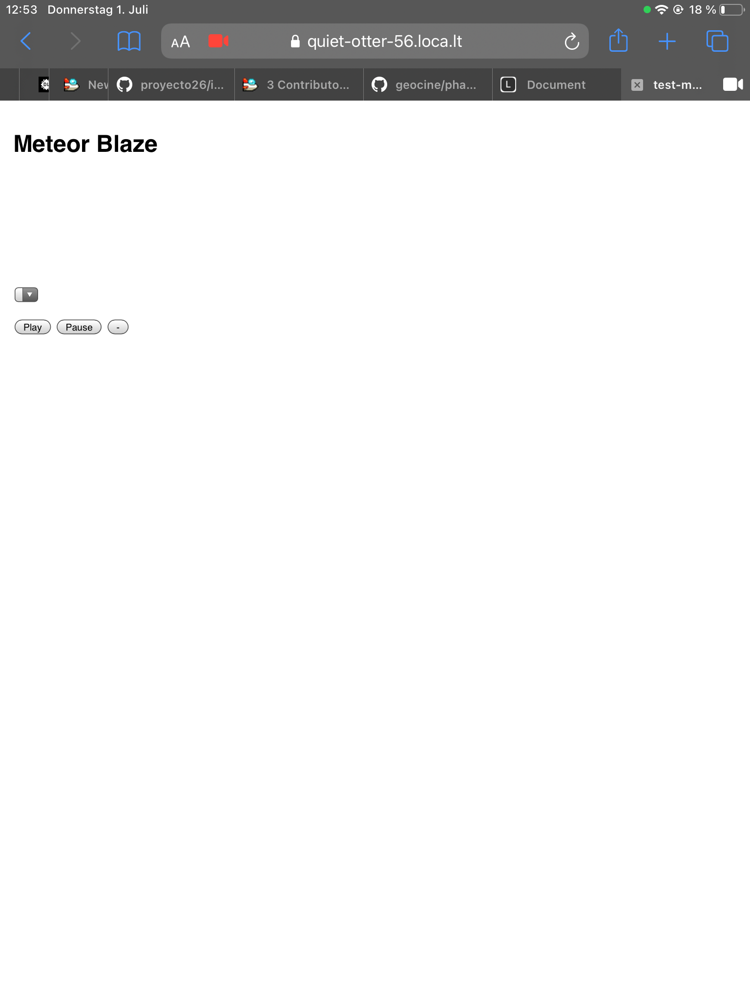
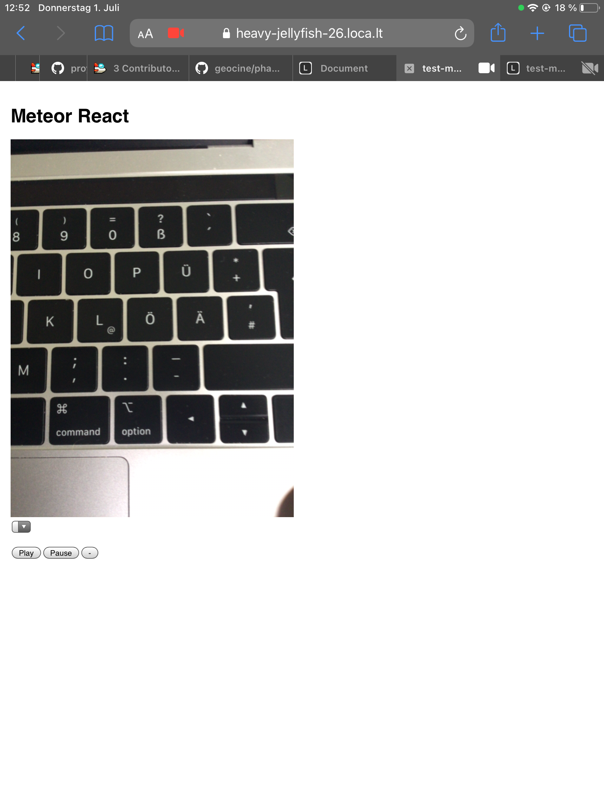

# Replication Repo for Video Bug on iOS with Blaze
This repository exists for easy replication of a bug with the video camera / video HTML element in Blaze on iOS with Safari.

## Bug Description
Opening the camera on iOS Safari results in a non-displaying video stream if using Blaze. If React is used, the video is displaying as expected. Tested on an iPad Air 2 with iOS version 14.4.2. Also tested on an iPhone X with iOS version 14.6 yielding same error. Interestingly, the error was *not* present on an iPhone 11 with iOS version 14.2. After updating this iPhone to iOS 14.6, the error appeared. So it has to do something with the camera permission requesting / video element within Blaze and with a change that appeared within iOS version 14.2 and 14.4.2.

## Bug Replication
There is also a "plain" HTML version in `test-html` which also seems to work.

1. Start Meteor in `test-meteor-blaze` and `test-meteor-react` (with different ports via `meteor run --port 5000` e.g.)
2. Access the webpage on an iDevice (I used an iPad Air 2 with iOS version 14.4.2 but the error was also found with iOS version 14.6). Keep in mind that you need a secure context to access the camera (e.g. by using https://github.com/localtunnel/localtunnel)
3. Click "Play" button
4. Accept the iOS permission popup
5. With React, the video element shows the camera screen correctly. With Blaze, it just shows nothing and reports no error.

## JavaScript Code
The JavaScript code for opening / displaying the camera is copied from the Codepen https://codepen.io/chrisbeast/pen/ebYwpX made by Chris.
